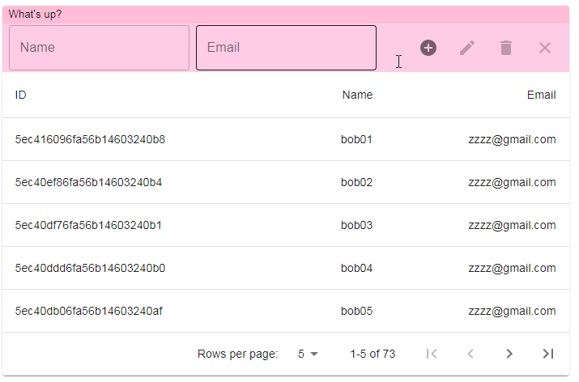
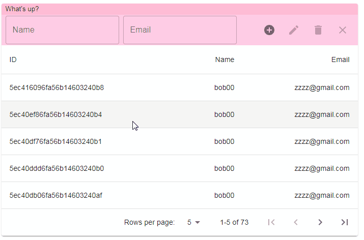
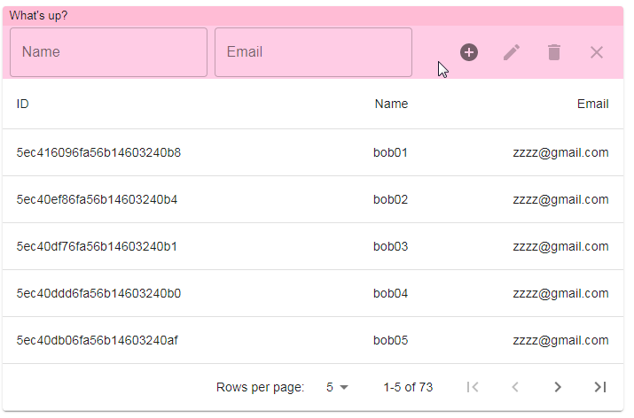
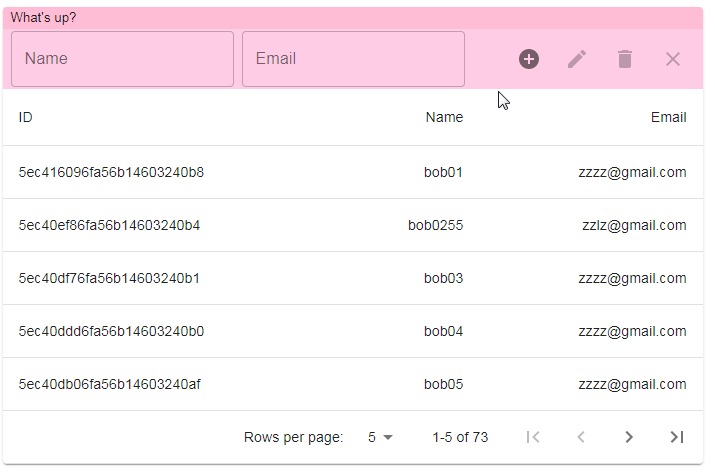

# nest-react-crud-test
Basic React CRUD app using NestJS server with GraphQL API and MongoDB

## Demo

Table is made with [Material UI](https://material-ui.com/)

Main layout and pagination taken from [Custom pagination actions Table Example](https://material-ui.com/components/tables/#custom-pagination-actions)

### Select rows

### Add new users

### Update selected user

### Delete selected user

